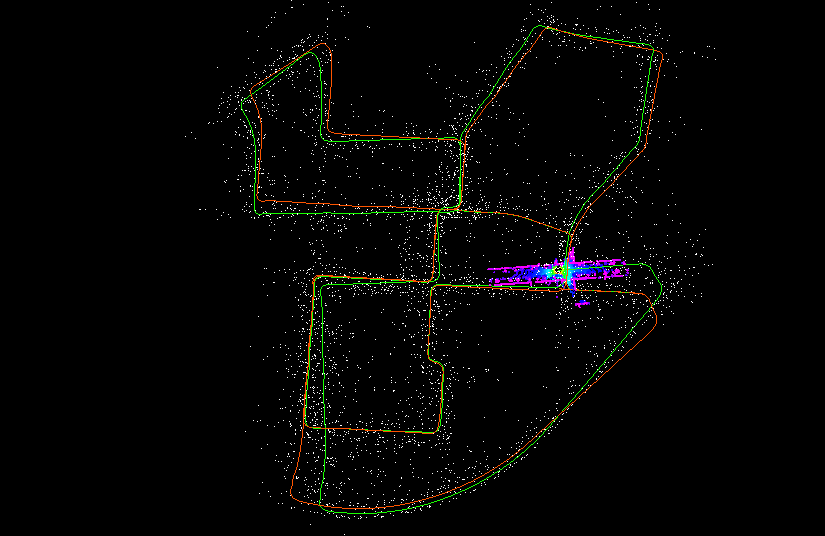

# SC-Light-LOAM
Inspired by @gisbi-kim's SC-A-LOAM, where ScanContext is added for coarse global localization that can deal with big drifts. For eg: on the KITTI- Seq 00, the green trajectory shows vanilla Light-LOAM, but with SC-Light-LOAM(red) we see pose graph optimized trajectory.
- <p align="center"></p>

## Light-LOAM
News: Our paper has been accepted by the RA-L journal! 
This is the implementation for the Paper ``Light-LOAM: A Lightweight LiDAR Odometry and Mapping based on Graph-Matching''. This code is modified from [A-LOAM](https://github.com/HKUST-Aerial-Robotics/A-LOAM).

## Requirements
* PCL 1.10
* ROS
* Ceres 2.2

## Introduction
This is the beta version, and the final implementation code is coming soon. The research paper [Light-LOAM: A Lightweight LiDAR Odometry and Mapping based on Graph-Matching](https://arxiv.org/abs/2310.04162) is now availble on arXiv.

## Citation

If you take pieces from our system in your research, please consider citing the [paper](https://arxiv.org/abs/2310.04162):

```
@ARTICLE{10439642,
  author={Yi, Shiquan and Lyu, Yang and Hua, Lin and Pan, Quan and Zhao, Chunhui},
  journal={IEEE Robotics and Automation Letters}, 
  title={Light-LOAM: A Lightweight LiDAR Odometry and Mapping Based on Graph-Matching}, 
  year={2024},
  volume={9},
  number={4},
  pages={3219-3226},
  keywords={Simultaneous localization and mapping;Feature extraction;Point cloud compression;Reliability;Odometry;Laser radar;Robots;SLAM;localization;data association},
  doi={10.1109/LRA.2024.3367268}}

```
---------
`roslaunch light_loam aloam_velodyne_HDL_64.launch `
## Acknowledgements
Thanks for [A-LOAM](https://github.com/HKUST-Aerial-Robotics/A-LOAM).


